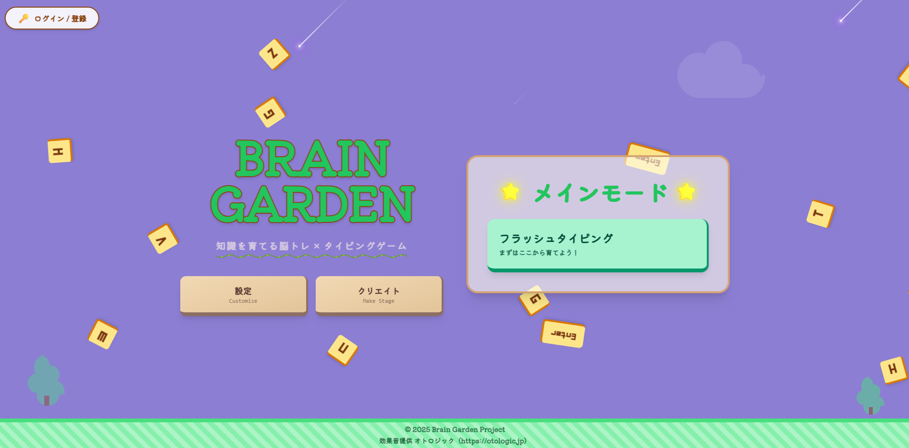
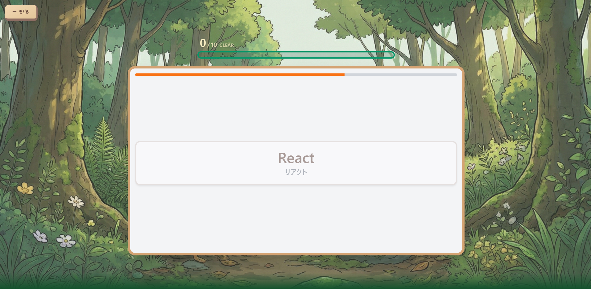

# BrainGarden

  <b>暗記を「勉強」から「ゲーム」へ。</b> 
  自分だけの暗記帳（メモリーセット）を作り、<b>暗記力</b>と（PCなら）<b>タイピング力</b>を同時に鍛えるメモリーゲーム。

  
    ✅ デザインの一貫性　｜　✅ 暗記×タイピングを一挙両得　｜　✅ 対戦で楽しく継続
  

---

## このゲームでできること

### 1. 暗記が苦手でも続く「ゲーム設計」

暗記を“勉強”として押し付けるのではなく、
**音・演出・UI**で「遊び」として自然に取り組めるようにしました。

### 2. 自分だけの暗記帳「メモリーセット」

**暗記したいものを自分で登録**して、オリジナルの暗記帳を作れます。

* 英単語
* 資格用語
* 歴史年号
* プログラミング構文
* 作品の用語集　など

| 項目 | 内容 |
|---|---|
| タイトル | メモリーセット名を設定 |
| 時間設定 | 暗記時間 / 回答時間を調整 |
| 暗記内容 | 単語・文章を登録（読みは任意） |
| 出題順 | 昇順 / ランダム / 苦手優先 |
| 終了条件 | 問題数 / 回答数で終了 |

> 自分専用の暗記帳を作って、「覚える→試す」をテンポよく回せます。

### 3. 実力を“実感できる”スコアリング

プレイ結果から**暗記力として可視化**されるので、
「できた／できなかった」だけでなく、**伸びが数字で分かる**のが特徴です。

---

## 遊び方（ざっくり3ステップ）

> **作る → 覚える → 試す** をテンポよく回して上達！

1. **メモリーセットを作成**

   * 覚えたい単語や用語を登録
2. **ゲームで暗記に挑戦**

   * 問題に答えて定着
3. **暗記力（＋PCはタイピング力）で実力チェック**

   * 結果が数値で見える

---

## モード紹介

### ソロプレイ

自分のペースで反復し、**暗記力を伸ばす**モード。

* 苦手な項目の克服に
* コツコツ続けたい人に

### 対戦プレイ

友達と競うことで、暗記が“イベント化”して続きます。

* **暗記力**や**タイピング力**を競える
* 友達と遊びながら脳トレ／勉強にも活かせる

---

## PCとスマホの違い

| デバイス    | 特徴              | 鍛えられる力           |
| ------- | --------------- | ---------------- |
| **PC**  | タイピングあり         | **暗記力 + タイピング力** |
| **スマホ** | タイピングなし（選択式）で気軽 | **暗記力**          |

スマホはタイピングがない代わりに、
**サクッと遊べるテンポ**を大事にしています。

---

## こだわったポイント

### デザインの一貫性

画面遷移・配色・レイアウト・フォント感・アニメーションまで、
**「統一されたゲーム体験」**になるよう設計しました。

### 音楽・効果音で“楽しい”に寄せる

暗記を「勉強」としてではなく、
**ゲームとして前向きに認識**してもらえるよう演出を強化しています。

### 暗記×タイピングを一挙両得

覚えるだけで終わらず、
**アウトプット（入力/選択）**まで含めて定着させる構造にしています。

---

## こんな人におすすめ

* 暗記が苦手で、続かない
* ゲーム感覚で学びたい
* 友達と競う方が頑張れる
* 暗記もタイピングも両方伸ばしたい（PC推奨）

---

## ホーム画面

### 箱庭デザイン × 一日の流れ（朝→昼→夜）
ホーム画面は「箱庭」をイメージし、時間の移ろい（朝→昼→夜）を取り入れました。  
ゲームを開くたびに雰囲気が変わることで、暗記を繰り返しても飽きにくい画面設計を目指しています。

- **朝 / 昼 / 夜の演出**をホームに組み込み、気分が切り替わる体験に
- 配色・UI・アニメーションを統一し、**世界観の一貫性**を重視
- 「勉強」ではなく「遊び」として入りやすいよう、**没入感**を設計

## プレイ画面（ソロモード）

### 静かな背景で、記憶に集中する
プレイ画面は情報量を減らし、緑を基調に目に優しく。  
長く遊んでも疲れにくい **集中のための背景** を目指しました。

---

## 使用技術（Tech Stack）

### Frontend

- React + TypeScript（SPA）
- ルーティング：React Router
- UI：Tailwind CSS（PostCSS）
- 端末最適化：PC / スマホでコンポーネントを分けて体験を最適化
- 設定管理：React Context（BGM/SE音量などを統一管理）

### Backend

- API：FastAPI（Uvicorn）
- バリデーション：Pydantic v2
- ORM：SQLAlchemy
- リアルタイム通信：WebSocket（対戦機能）

### Database

- SQLite（ローカル開発）
- PostgreSQL（本番運用想定 / `DATABASE_URL` で切り替え可能）

### Auth / Security
- パスワードハッシュ：passlib
- 認証：JWT（python-jose） + OAuth2 Password Flow

### Tooling
- ESLint（静的解析）

